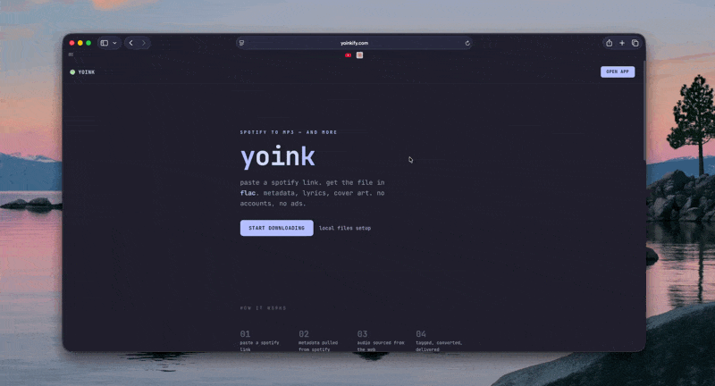

# yoink

paste a music link. get the file.

**[yoinkify.com](https://yoinkify.com)**

<p align="center">
  
</p>

## features

- **tracks, playlists, albums, artists** — paste a link, download everything
- **lossless** — flac, alac, or 320kbps mp3
- **full metadata** — id3v2/vorbis tags, album art, synced lyrics, genre, track numbers, explicit flags
- **apple music catalog matching** — ISRC codes, album artist, and itunes catalog ids embedded into m4a files so apple music recognizes your library
- **cross-platform links** — apple music and youtube links resolved automatically via song.link
- **search** — type a song name instead of pasting a link
- **multi-source audio** — waterfall pipeline across deezer, tidal, and youtube with automatic fallback
- **metadata fallback chain** — spotify, deezer, and itunes as metadata sources with automatic failover
- **no accounts** — no sign-up, no cookies, no data stored

## how it works

1. you paste a spotify (or apple music / youtube) link
2. yoink pulls metadata from spotify, with fallbacks to deezer and itunes
3. audio is sourced from the best available provider (deezer > tidal > youtube)
4. the file is tagged with full metadata, album art, and lyrics, then delivered to your browser

nothing is stored on the server after your request completes.

## stack

- [Next.js](https://nextjs.org) 16 (app router, turbopack)
- [Tailwind CSS](https://tailwindcss.com) 4
- [ffmpeg](https://ffmpeg.org) for conversion and metadata embedding
- [Spotify Web API](https://developer.spotify.com/documentation/web-api) for metadata
- [Deezer](https://developers.deezer.com) for lossless audio and metadata fallback
- [Tidal](https://developer.tidal.com) for hi-res audio
- [Piped](https://github.com/TeamPiped/Piped) for youtube audio
- [lrclib](https://lrclib.net) + [Musixmatch](https://www.musixmatch.com) for lyrics
- [Song.link](https://song.link) for cross-platform link resolution
- [iTunes Search API](https://developer.apple.com/library/archive/documentation/AudioVideo/Conceptual/iTuneSearchAPI) for genre data and catalog matching

## self-hosting

### docker (recommended)

```bash
git clone https://github.com/heysonder/yoink.git
cd yoink
docker compose up -d
```

that's it — yoink works out of the box with zero configuration. audio is sourced from youtube via yt-dlp, and metadata comes from public APIs. for lossless audio or better reliability, copy `.env.example` to `.env` and add your credentials (see below).

yoink will be running on `http://localhost:3000`.

### local dev

```bash
git clone https://github.com/heysonder/yoink.git
cd yoink
npm install
cp .env.example .env.local
# fill in your env vars (see below)
npm run dev
```

requires [ffmpeg](https://ffmpeg.org/download.html) installed locally.

### env vars

| variable | required | description |
|---|---|---|
| `SPOTIFY_CLIENT_ID` | no | spotify app client id ([create one](https://developer.spotify.com/dashboard)) — falls back to public APIs if not set |
| `SPOTIFY_CLIENT_SECRET` | no | spotify app client secret |
| `PIPED_API_URL` | no | piped instance url — we recommend [self-hosting piped](https://docs.piped.video/docs/self-hosting/) as public instances are unreliable |
| `DEEZER_ARL` | no | deezer session cookie — enables lossless audio from deezer |
| `TIDAL_CLIENT_ID` | no | tidal app client id |
| `TIDAL_CLIENT_SECRET` | no | tidal app client secret |
| `TIDAL_ACCESS_TOKEN` | no | tidal access token — enables hi-res audio from tidal |
| `TIDAL_REFRESH_TOKEN` | no | tidal refresh token |
| `SONGLINK_ENABLED` | no | enable cross-platform link resolution (`true`/`false`) |
| `ACOUSTID_API_KEY` | no | audio fingerprinting for better source matching |
| `MUSIXMATCH_TOKEN` | no | musixmatch lyrics as fallback when lrclib misses |
| `LRCLIB_PROXY_URL` | no | cloudflare worker proxy for lrclib if direct access is blocked |

no env vars are required — yoink works out of the box with public APIs for metadata and youtube (via piped) for audio. however, public piped instances are unstable and may cause download failures — for reliable youtube downloads, [self-host piped](https://docs.piped.video/docs/self-hosting/) or provide deezer/tidal credentials. for lossless audio (flac/alac), you'll need a deezer or tidal account to provide the `DEEZER_ARL` or tidal credentials.

### getting lossless audio with deezer (self-hosted only)

if you're self-hosting yoink, you can enable lossless (flac) downloads by providing a deezer ARL token. the web version at [yoinkify.com](https://yoinkify.com) already has this configured — this section is only for self-hosted instances.

deezer offers a **1 month free trial** of premium, which now includes hifi (lossless) streaming:

1. sign up for a [deezer premium trial](https://www.deezer.com/en/offers) (no charge for the first month)
2. log in to [deezer.com](https://www.deezer.com) in your browser
3. open dev tools (F12) → application tab → cookies → `www.deezer.com`
4. find the cookie named `arl` — copy its value (it's a 192-character string)
5. set `DEEZER_ARL` in your `.env` to that value
6. download everything you want in flac

the ARL token lasts 3-6 months before expiring. you can cancel the trial before it renews if you just need it for a one-time library download.

### youtube audio source

yoink uses youtube as a fallback audio source when deezer and tidal aren't configured. audio is fetched via [piped](https://github.com/TeamPiped/Piped), a youtube proxy. public piped instances can be unreliable — for best results, [self-host your own piped instance](https://docs.piped.video/docs/self-hosting/) and set `PIPED_API_URL` to point to it. note that youtube audio is ~160kbps opus, not lossless.

## rate limits

default limits (per IP, in-memory):

- 30 downloads / minute
- 5 playlist downloads / minute (max 200 tracks per playlist)
- 15 searches / minute
- 10 metadata lookups / minute

self-hosted instances have no rate limits by default — adjust in `src/lib/ratelimit.ts`.

## attribution

if you fork or self-host yoink, a "powered by [yoink](https://yoinkify.com)" mention is appreciated but not required.

## support

[](https://ko-fi.com/O5O31P50IY)

## license

this project uses [AGPL-3.0](LICENSE)
